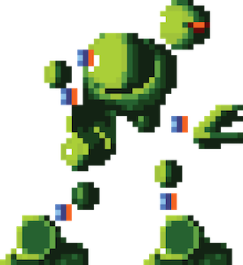
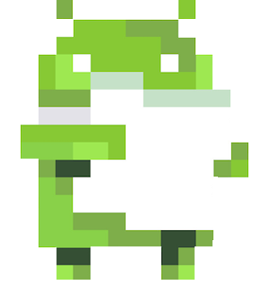

# svg2vd
Convert SVGs to Android Vector Drawables



## Building

Build using the bundled Gradle wrapper.

```bash
./gradlew jar
```


## Running

```bash
java -jar svg2vd-0.1.jar
```

### Help

```
Usage: svg2vd [OPTIONS] [SOURCE]... DEST

Options:
  -f, --force              Force overwrites any existing files in the OUTPUT
                           directory
  -v, --verbose            Verbose logging, show files as they are converted
  -c, --continue-on-error  If an error occurs, continue processing SVGs
  -o, --optimize           Run Avocado on generated VectorDrawables
  --version                Display information about svg2vd
  -h, --help               Show this message and exit

Arguments:
  SOURCE  SVG files
  DEST    Directory to save VectorDrawables
```

### Avocado support

To further optimize the VectorDrawable, use the `-o` option. This requires Avocado, a third-party app the be installed and accessible in your `PATH`.

Install `avocado` using `npm`

```bash
npm install -g avocado
```

See [Avocado's GitHub page](https://github.com/alexjlockwood/avocado) for more information.
